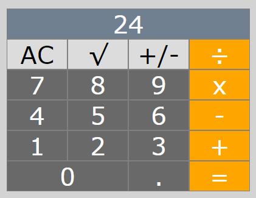

# calculator-app

## Simple application made using Vue.js. This is my first Vue.js project, made after watching:

## -> Build a Calculator with Vue.js (https://www.youtube.com/watch?v=m1_ih43p24s)

## With my version of the application I fixed two bugs that existed in the original video:

### - NaN after giving only current value and clicking "equal" sign

### - using multiple 0s at the beginning of the number

